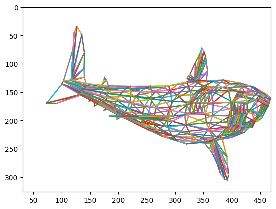
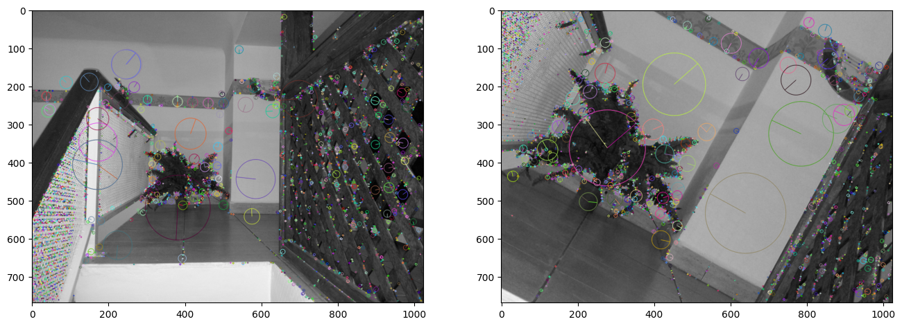
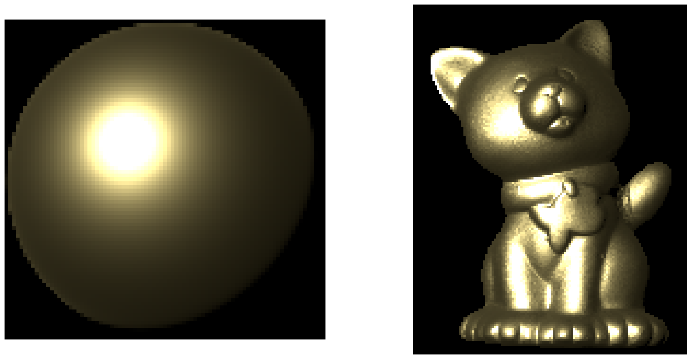
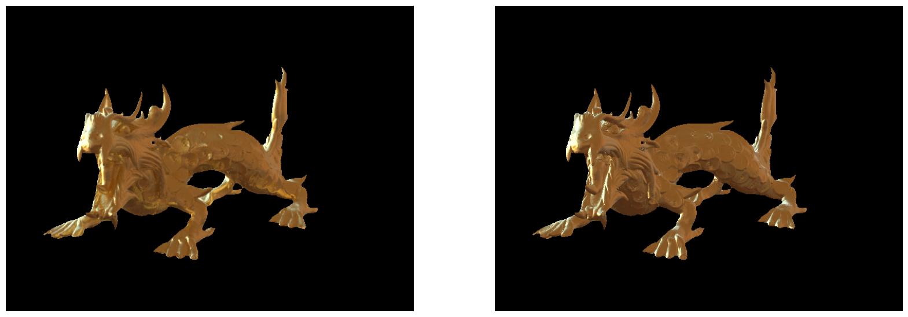
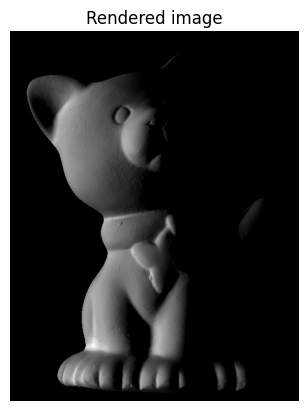
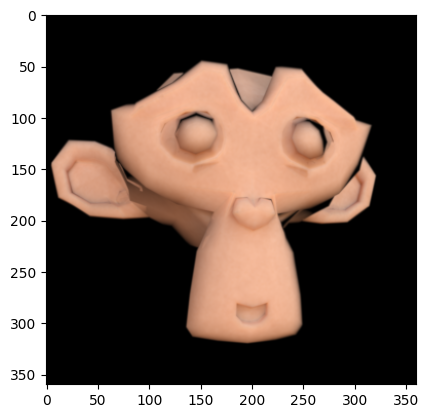

# VICO - Computer Vision and Graphics

This repository is my practical notebook collection for the University of York third-year Computer Vision and Graphics module. It is a record of the things I actually built during the module: image processing, camera geometry, feature matching, reconstruction, physically based rendering, Monte Carlo methods, and relighting.

I scored 83% in the closed-book in-person exam for the module, but this repo stores the unassessed practicals. The notebooks move from first principles in image formation to the more visual parts of the subject, including MatCaps, photometric stereo, path tracing, and environment-map relighting.

This module gave me a brilliant grounding in Computer Vision and Graphics, and has had a lasting impact on my future career.

## What It Covers

In broad terms, the practicals cover three linked areas:

- Image and geometry fundamentals: images, meshes, perspective projection, colour, homographies, and stereo
- Vision and reconstruction: SIFT features, matching, robust estimation, photometric stereo, and 3D recovery
- Rendering and appearance: BRDFs, non-photorealistic rendering, ray tracing, Monte Carlo integration, and relighting

## Highlights

These are some of the more interesting outputs from the notebooks.

<table>
	<tr>
		<td align="center"> Week 1: shark mesh projected into the image plane using the camera intrinsics and extrinsics, then drawn as a triangle wireframe.</td>
		<td align="center"> Week 4: SIFT keypoints plotted on a plant scene, showing how the same structures are detected with different scale and orientation.</td>
	</tr>
	<tr>
		<td align="center"> Week 6: the rendered MatCap sphere beside a cat figurine after appearance transfer, non-photorealistic relighting from a sphere lookup.</td>
		<td align="center"> Week 7: dragon rendered in Mitsuba compared with a MatCap approximation</td>
	</tr>
	<tr>
		<td align="center"> Week 9: a photometric-stereo reconstruction of a cat relit with a new directional source from the recovered normal and albedo maps.</td>
		<td align="center"> Week 10: Suzanne relit using a corrected environment map and reflectance-field data, showing final Light Stage-style relighting.</td>
	</tr>
</table>

## Practical Index

- <a href="VICO_Week_1_Practical.ipynb">Week 1 - Introduction to images, meshes, and perspective projection</a>: loads an image and a PLY mesh, then projects a shark model into the image plane and draws it as a wireframe.
- <a href="VICO_Week_2_Practical.ipynb">Week 2 - Colour correction, radiometry, and photometry</a>: explores sensor response, colour correction, gamma, and basic photometric reasoning.
- <a href="VICO_Week_3_Practical.ipynb">Week 3 - Homographies</a>: estimates homographies, performs rectification, and builds perspective warps for image stitching.
- <a href="VICO_Week_4_Practical.ipynb">Week 4 - Local features</a>: detects and matches SIFT features, then uses robust estimation and stereo-related geometry.
- <a href="VICO_Week_5_2024_Practical.ipynb">Week 5 - Analytical BRDF models</a>: implements reflectance models and studies how material appearance changes with lighting and view direction.
- <a href="VICO_Practical_Week_6_2024.ipynb">Week 6 - Non-photorealistic rendering and ray tracing</a>: builds a MatCap-based cat render, then moves into basic ray tracing and reflections.
- <a href="VICO_Week_7_2024_Practical.ipynb">Week 7 - Monte Carlo integration and path tracing</a>: works through sampling, importance sampling, and rendering-oriented numerical experiments.
- <a href="VICO_Week_8_2024_Practical.ipynb">Week 8 - Binocular stereo and 3D reconstruction</a>: estimates disparity, rectifies stereo pairs, and reconstructs 3D structure.
- <a href="VICO_Week_9_Practical.ipynb">Week 9 - Photometric stereo</a>: recovers normals and albedo from a lighting stack, then relights the object from a new direction.
- <a href="VICO_Week_10_2024_25.ipynb">Week 10 - Relighting using the reflectance field</a>: uses reflectance fields and Mitsuba environment lighting to relight Suzanne like a Light Stage acquisition.

## Environment

The notebooks use a Python stack built around NumPy, Matplotlib, OpenCV, `opencv-contrib-python`, `plyfile`, and Mitsuba. A few notebooks also rely on the included `.npy` assets and small external downloads for images and scene data.